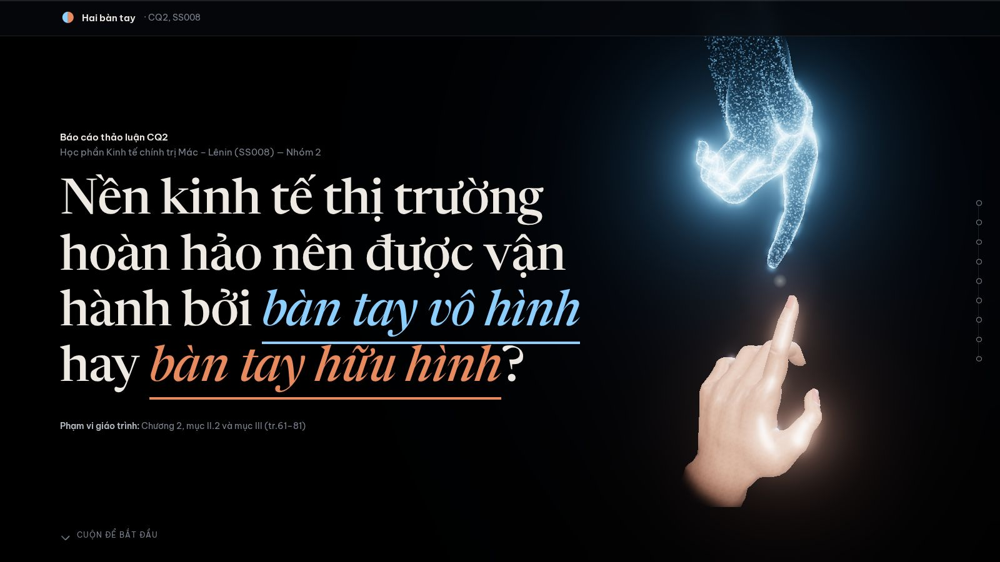
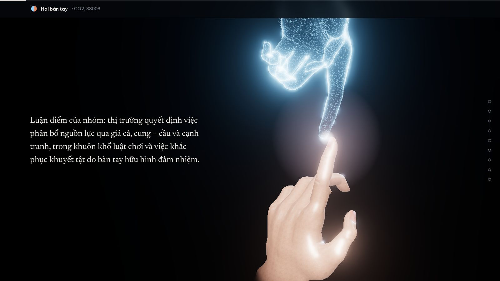
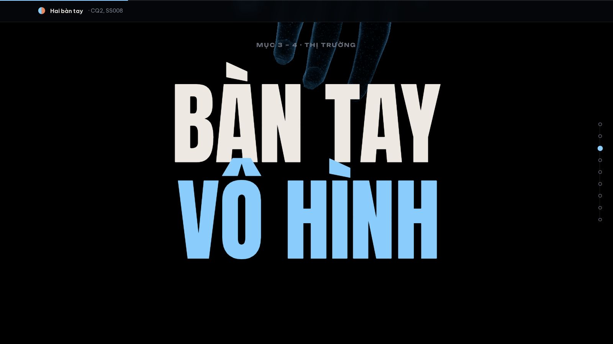
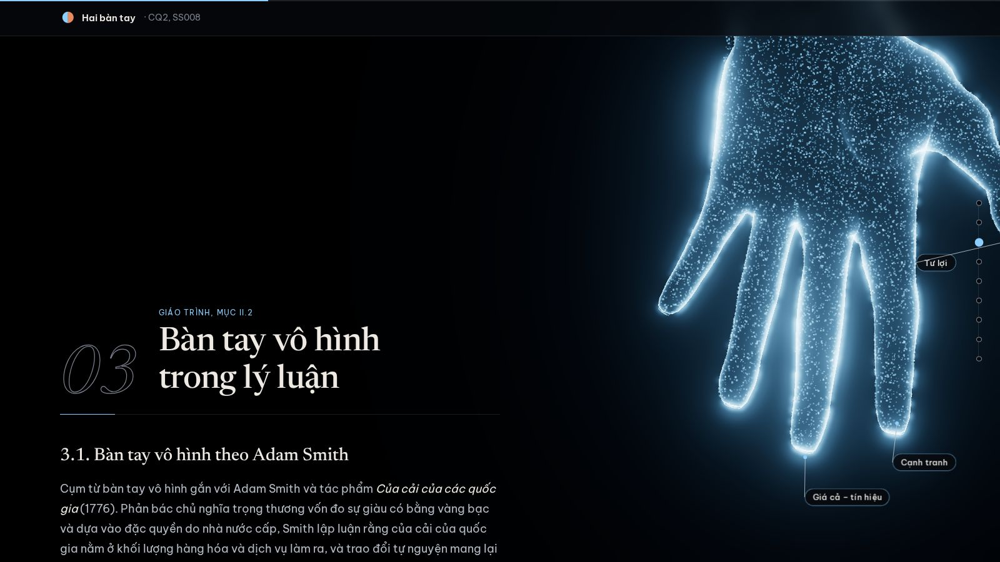
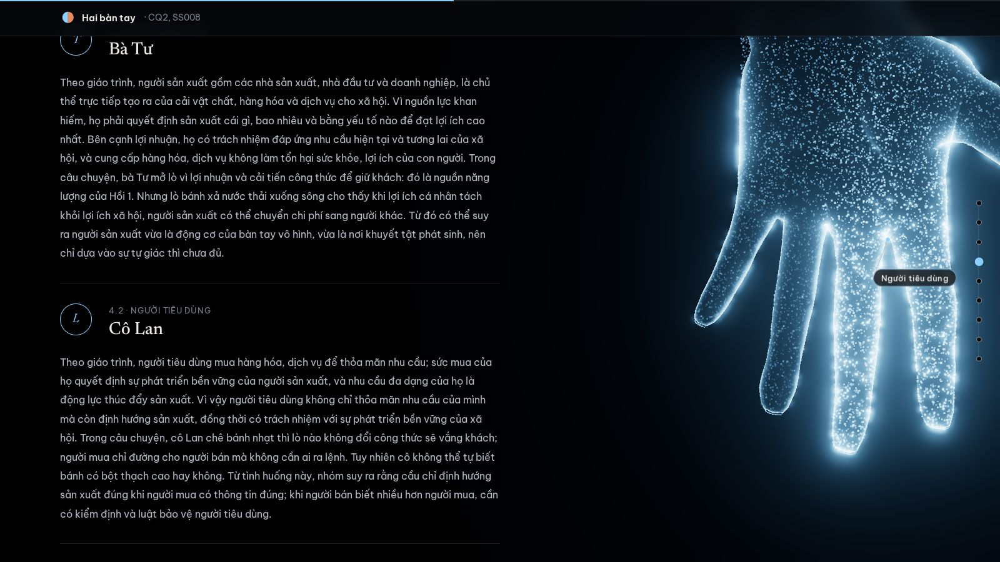
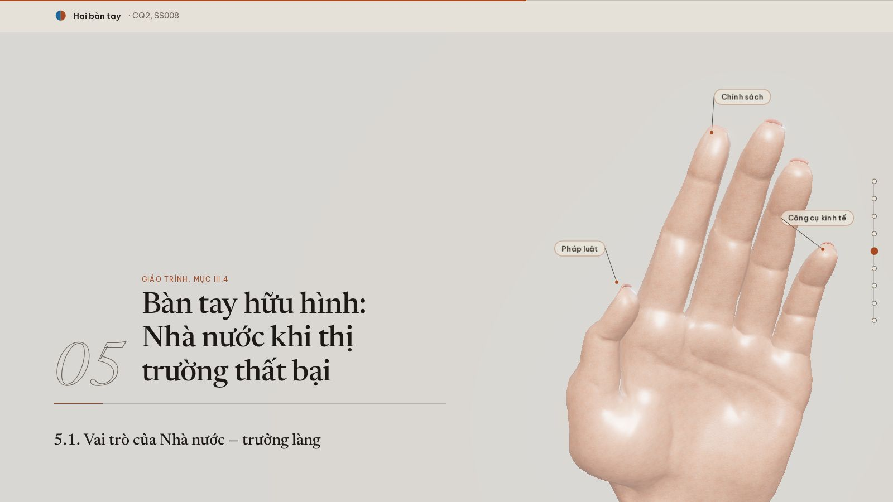
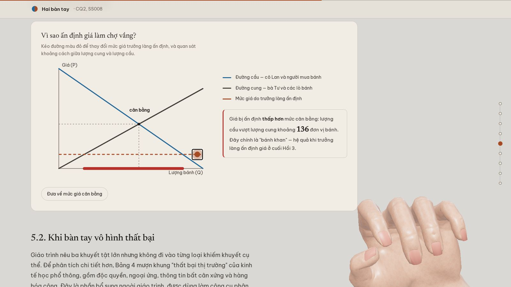
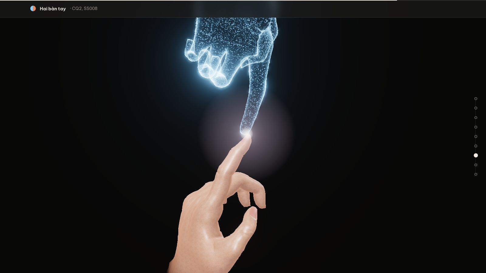
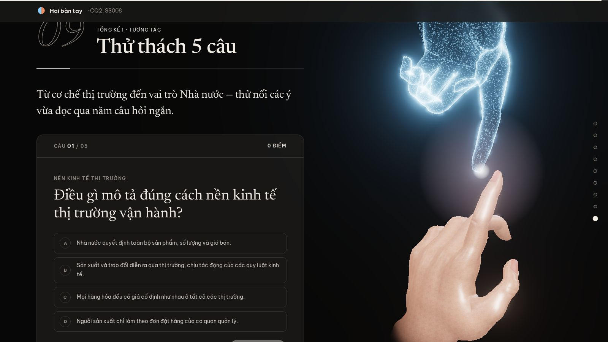

<div align="center">

# CQ2 — Bàn tay vô hình / Bàn tay hữu hình

**Trang web thuyết trình tương tác 3D · SS008 Kinh tế chính trị Mác – Lênin · Nhóm 2**




[**🌐 Xem trực tuyến**](https://nhutwang.github.io/CQ2-adam-smith/) · [🚀 Chạy trên máy](#-hướng-dẫn-khởi-chạy) · [🎮 Khi thuyết trình](#-hướng-dẫn-tương-tác-khi-thuyết-trình) · [📂 Cấu trúc](#-cấu-trúc-dự-án)

</div>

Trang web thuyết trình tương tác 3D minh họa câu hỏi thảo luận CQ2: *Nền kinh tế thị trường hoàn hảo nên được vận hành bởi "bàn tay vô hình" hay "bàn tay hữu hình"?* Toàn bộ lập luận được kể bằng hai bàn tay 3D có xương thật. **Bàn tay vô hình** là hạt sáng và viền phát quang, tượng trưng cho cơ chế thị trường tự điều tiết theo Adam Smith. **Bàn tay hữu hình** mang lớp da người, tượng trưng cho sự điều tiết của Nhà nước. Khi người xem cuộn trang, hai bàn tay đổi tư thế, đổi vị trí và phản ứng theo đúng đoạn nội dung đang được nói tới, còn nền trang đổi màu theo bàn tay đang giữ vai chính.

> [!NOTE]
> **Luận điểm của nhóm.** Thị trường quyết định việc phân bổ nguồn lực qua giá cả, cung – cầu và cạnh tranh, trong khuôn khổ luật chơi; việc khắc phục khuyết tật của thị trường do bàn tay hữu hình đảm nhiệm. Vì vậy, hình ảnh xuyên suốt của trang là hai bàn tay vươn về phía nhau: bàn tay vô hình rủ từ trên xuống, bàn tay hữu hình vươn từ dưới lên, hai đầu ngón trỏ gặp nhau qua một khe sáng.

---

## 🖼️ Hình ảnh

<table>
  <tr>
    <td width="50%"><br><sub><b>Trang đầu.</b> Tiêu đề phóng to bay qua camera, hai bàn tay ra giữa màn hình, luận điểm hiện ra đúng lúc khe sáng lóe lên.</sub></td>
    <td width="50%"><br><sub><b>Đoạn chữ lớn chuyển chương.</b> Hai dòng chữ trượt vào từ hai phía, phóng to xuyên qua màn hình, rồi bàn tay hiện ra phía sau.</sub></td>
  </tr>
  <tr>
    <td><br><sub><b>Mục 3.</b> Bàn tay vô hình rủ xuống, mỗi đầu ngón mang một động lực của thị trường.</sub></td>
    <td><br><sub><b>Mục 4.</b> Bàn tay giữ nguyên một khối, nhóm ngón của chủ thể đang được nhắc tới sáng lên.</sub></td>
  </tr>
  <tr>
    <td><br><sub><b>Mục 5.</b> Lá chớp phủ nền giấy, bàn tay hữu hình vươn lên với ba công cụ của Nhà nước.</sub></td>
    <td><br><sub><b>Đồ thị ấn định giá.</b> Kéo đường giá xuống thấp, thiếu hụt hiện ra và bàn tay hữu hình nắm chặt lại.</sub></td>
  </tr>
  <tr>
    <td><br><sub><b>Mục 7.</b> "Mỗi bàn tay, một phần việc": hai ngón trỏ chạm nhau trước khi trả lời CQ2.</sub></td>
    <td><br><sub><b>Trắc nghiệm.</b> Năm câu hỏi có giải thích, cặp bàn tay chạm nhau khép lại cả trang.</sub></td>
  </tr>
</table>

---

## 🚀 Hướng dẫn khởi chạy

> [!WARNING]
> **Không nháy đúp trực tiếp vào `index.html`.** Khi mở bằng giao thức `file://`, trình duyệt chặn nạp ES module (`scene3d.js`), nên sân khấu 3D không hiển thị được. Hãy dùng một trong các cách dưới đây, hoặc mở bản [xem trực tuyến](https://nhutwang.github.io/CQ2-adam-smith/).

### Cách 1: Nhanh nhất trên Windows (khuyên dùng)

- Nháy đúp vào tệp **`chay-web.cmd`** ở thư mục gốc của repo.
- Tệp này tự tìm Python 3 hoặc Node.js, tự chọn cổng còn trống và mở trình duyệt tại `http://127.0.0.1:8080/index.html`.
- Muốn đổi cổng: mở cmd tại thư mục gốc và gõ `chay-web.cmd 9000`.

### Cách 2: Dùng Python

Mở terminal tại thư mục `ban-tay-web/` và chạy:

```bash
python -m http.server 8080 --bind 127.0.0.1
```

Sau đó truy cập `http://127.0.0.1:8080/index.html`.

### Cách 3: Dùng Node.js

```bash
cd ban-tay-web
npx --yes serve . -l 8080
```

### Cách 4: Dùng Visual Studio Code

- Cài extension **Live Server**.
- Mở thư mục `ban-tay-web` trong VS Code.
- Chuột phải vào `index.html` và chọn **Open with Live Server**.

---

## 🌐 Không cần kết nối mạng

Mọi thứ trang cần đều nằm sẵn trong thư mục `ban-tay-web`, nên có thể thuyết trình ở phòng học không có Internet:

- **three.js 0.186**: WebGL 3D, trình nạp mô hình GLB và hiệu ứng phát sáng, trong `vendor/three`.
- **GSAP 3.15 và ScrollTrigger**: chuyển động chữ theo cuộn, trong `vendor/gsap`.
- **Lenis 1.3**: cuộn mượt, trong `vendor/lenis`.
- **Phông chữ** Be Vietnam Pro, Newsreader, Anton, Unbounded, trong `fonts/`.
- **Hai mô hình bàn tay** `hand-visible.glb` và `hand-invisible.glb`, trong `models/`.

---

## 🎬 Mạch nội dung và vai diễn của hai bàn tay

Trang đi theo trình tự của một bài lập luận: đặt vấn đề, xây dựng ẩn dụ, trình bày lý luận về từng bàn tay, liên hệ thực tiễn rồi mới trả lời câu hỏi. Mỗi phần giao cho hai bàn tay một vai cụ thể để hình ảnh luôn phục vụ nội dung chứ không chỉ để trang trí.

| Phần | Nội dung | Hai bàn tay làm gì |
| --- | --- | --- |
| Trang đầu | Câu hỏi CQ2 và luận điểm của nhóm | Chạm tay dọc; tiêu đề phóng to bay qua, luận điểm hiện khi khe sáng lóe lên |
| 1. Đặt vấn đề | Thị trường hoàn hảo và hai cách vận hành | Vắng mặt, để người nghe tập trung vào chữ |
| 2. Câu chuyện phiên chợ làng Hòa Thị | Ẩn dụ ba hồi xuyên suốt báo cáo | Bàn tay vô hình khum trên phiên chợ; Hồi 2 hạt rung và đổi màu; Hồi 3 bàn tay hữu hình vươn lên đỡ bên dưới |
| Chữ lớn "Bàn tay vô hình" | Chuyển sang phần thị trường | Chữ bay qua, bàn tay vô hình rủ xuống từ trên cao |
| 3. Bàn tay vô hình trong lý luận | Adam Smith, kinh tế thị trường theo giáo trình, các quy luật | Nhãn nằm ở đầu ngón: tư lợi, cạnh tranh, giá cả; rồi bốn quy luật |
| 4. Ba chủ thể | Người sản xuất, người tiêu dùng, trung gian | Nhóm ngón của từng chủ thể sáng lên khi đoạn tương ứng được đọc |
| Chữ lớn "Bàn tay hữu hình" | Chuyển sang phần Nhà nước | Lá chớp phủ nền giấy, bàn tay hữu hình vươn lên từ đáy |
| 5. Nhà nước khi thị trường thất bại | Vai trò Nhà nước, khuyết tật thị trường | Nhãn Pháp luật, Chính sách, Công cụ kinh tế; đồ thị ấn định giá điều khiển độ nắm của bàn tay |
| 6. Hai nghị quyết | Nghị quyết 68-NQ/TW và 79-NQ/TW | Kinh tế tư nhân đi với bàn tay vô hình, kinh tế nhà nước đi với bàn tay hữu hình |
| Chữ lớn "Mỗi bàn tay, một phần việc" | Chuyển sang câu trả lời | Hai ngón trỏ chạm nhau ở giữa màn hình |
| 7. Trả lời CQ2 | So sánh, kết luận, phản biện, câu hỏi thảo luận | Ở 7.2 lớp da tan dần, lộ bàn tay vô hình nằm bên trong bàn tay hữu hình |
| 8. Phạm vi và tài liệu tham khảo | Giới hạn của báo cáo, nguồn trích dẫn | Cặp chạm tay lớn ở nửa phải |
| 9. Thử thách 5 câu | Trắc nghiệm có giải thích | Cặp chạm tay khép lại cả trang |

---

## ✨ Hiệu ứng nổi bật

Hai bàn tay tuân theo một ngôn ngữ chung: bàn tay vô hình luôn đến từ phía trên, bàn tay hữu hình luôn đến từ phía dưới. Nhờ quy ước này, người xem nhận ra bàn tay nào đang lên tiếng mà không cần chú thích, và khi hai bàn tay gặp nhau thì bố cục dọc tự nhiên gợi đến hình ảnh "Sáng tạo Adam".

Để hai bàn tay có cảm giác như đang thật sự bị giữ trong trang web chứ không phải tượng đứng yên, mỗi khung hình được làm mượt theo quán tính. Trang kéo bàn tay theo nhịp cuộn rồi để nó đàn hồi về chỗ như có lò xo, các ngón tay thở lệch pha nhau, và khi người xem dừng cuộn một lúc, bàn tay tự xòe ra như áp vào mặt kính màn hình. Cổ tay tan dần vào nền theo chiều dài thật của bàn tay nên không bao giờ lộ vết cắt của mô hình.

Chữ cũng tham gia vào chuyển động. Tiêu đề trang đầu phóng to bay qua camera. Ba đoạn chữ lớn chuyển chương làm theo tinh thần của lenis.dev: chữ trượt vào, phóng to xuyên qua màn hình, rồi bàn tay hiện ra phía sau. Tiêu đề mỗi mục trồi lên từng chữ một lần, nên khi người thuyết trình dừng lại để nói, chữ không bị kẹt giữa chừng. Khi một bảng hoặc khối chữ rộng chiếm màn hình, bàn tay tự chìm tối để nhường chỗ cho nội dung.

---

## 🎮 Hướng dẫn tương tác khi thuyết trình

- **Điều hướng nhanh:** dùng phím `↑` / `↓` hoặc `PageUp` / `PageDown`. Trang dừng ở từng mục, ở luận điểm của trang đầu và ở lúc bàn tay hiện ra sau mỗi đoạn chữ lớn.
- **Mục 2, câu chuyện phiên chợ:** bấm các tab *Hồi 1 / Hồi 2 / Hồi 3*, bàn tay 3D diễn theo từng hồi.
- **Mục 5, đồ thị ấn định giá:** kéo đường giá màu đỏ. Giá càng thấp, thiếu hụt càng lớn và bàn tay hữu hình đứng cạnh khung càng nắm chặt. Bấm *Đưa về mức giá cân bằng* để hoàn tác.
- **Mục 7.2, kết luận:** cuộn chậm để thấy lớp da tan dần, lộ bàn tay vô hình bên trong bàn tay hữu hình.
- **Rê chuột:** hai bàn tay nghiêng nhẹ theo con trỏ.
- **In ấn hoặc xuất PDF:** bấm `Ctrl + P` (hoặc `Cmd + P` trên macOS), sân khấu 3D được ẩn để bản in chỉ còn chữ.

> [!TIP]
> Trang tự đo tốc độ khung hình và giảm độ phân giải hoặc số hạt nếu máy chậm. Có thể ép mức chất lượng bằng tham số địa chỉ: `index.html?q=2` là đầy đủ, `?q=1` là vừa, `?q=0` là nhẹ nhất. Nên chạy thử trước trên chính máy sẽ chiếu; nếu `?q=2` vẫn mượt thì dùng địa chỉ đó khi thuyết trình.

---

## 📂 Cấu trúc dự án

```text
CQ2-adam-smith/
├── ban-tay-web/                    # Toàn bộ trang web, chạy được độc lập
│   ├── index.html                  # Nội dung: trang đầu, 8 mục, 3 đoạn chữ lớn, trắc nghiệm
│   ├── README.txt                  # Ghi chú kỹ thuật ngắn khi mở thư mục trang
│   ├── css/
│   │   ├── style.css               # Hệ màu theo chương, bố cục, hiệu ứng chữ, bản in
│   │   └── fonts.css               # Khai báo phông chữ cục bộ
│   ├── js/
│   │   ├── main.js                 # Cuộn mượt, đổi chủ đề, phím điều hướng, chữ lớn, đồ thị cung – cầu
│   │   ├── scene3d.js              # Sân khấu three.js: hai bàn tay có xương, kịch bản theo cuộn, nhãn đầu ngón
│   │   ├── poses.js                # Thư viện tư thế bàn tay
│   │   └── quiz.js                 # Trắc nghiệm 5 câu
│   ├── models/
│   │   ├── hand-visible.glb        # Bàn tay hữu hình: mô hình giải phẫu, 21 xương
│   │   └── hand-invisible.glb      # Bàn tay vô hình: cùng bộ xương, hiển thị bằng hạt và viền sáng
│   ├── fonts/                      # Be Vietnam Pro, Newsreader, Anton, Unbounded
│   └── vendor/                     # three.js, GSAP, Lenis (bản cục bộ)
├── docs/images/                    # Ảnh chụp dùng trong README
├── .github/workflows/pages.yml     # Tự đăng thư mục ban-tay-web lên GitHub Pages
├── chay-web.cmd                    # Tệp một chạm khởi động máy chủ cục bộ trên Windows
├── NOI_DUNG_THUYET_TRINH.txt       # Toàn văn nội dung báo cáo và dàn ý thuyết trình
└── README.md                       # Tài liệu tổng quan dự án
```

---

## 🛠️ Tinh chỉnh bàn tay và hiệu ứng

Toàn bộ vai diễn của hai bàn tay nằm trong mảng `KEYS_SPEC` của `ban-tay-web/js/scene3d.js`. Mỗi phần tử là một khóa neo vào một phần tử của trang, ví dụ `at: '#s3 .section__head'`. Khi người xem cuộn qua, trang nội suy mượt giữa hai khóa liên tiếp. Thông số nào không ghi thì kế thừa từ khóa trước, nên mỗi khóa chỉ cần mô tả điều thay đổi.

| Thông số | Ý nghĩa |
| --- | --- |
| `show` | Hiện hoặc ẩn bàn tay, từ 0 đến 1 |
| `x`, `y` | Vị trí cổ tay trên màn hình, từ -1 đến 1; `y = 1` là mép trên |
| `size` | Chiều dài bàn tay so với nửa chiều cao màn hình |
| `angle` | Hướng ngón tay: 0 là chỉ lên, 180 là chỉ xuống |
| `tilt`, `roll` | Ngả ngón về phía người xem, xoay quanh trục cánh tay |
| `dim`, `fade` | Chìm tối chỉ còn viền sáng; độ tan của cổ tay vào nền |
| `pose` | Tư thế: `open`, `reach`, `relax`, `cup`, `flat`, `point`, `grip`, `fist`, `god`... |
| `PAIR(mx, my, size, gap, spark)` | Dựng sẵn một cặp chạm tay dọc với điểm gặp tại `(mx, my)` |

Mở Console của trình duyệt và gõ `__hands.KEYS` để xem hoặc thử giá trị trực tiếp khi trang đang chạy.

---

## ⚙️ Công nghệ và hiệu năng

Trang viết bằng HTML, CSS và JavaScript thuần nên không cần bước build. Bàn tay vô hình là một lớp hạt bám trên mặt da, được cập nhật theo xương ở mỗi khung hình, cộng với một lớp vỏ phát sáng theo hiệu ứng Fresnel. Bàn tay hữu hình dùng vật liệu da đã chỉnh lại, có chế độ chỉ còn viền sáng khi cần nhường chỗ cho chữ. Trang đã được thử trên laptop dùng card Intel Iris Xe ở khung 1366 × 768: khi cuộn qua trang đầu và các đoạn chữ lớn, trang giữ khoảng 60 khung hình mỗi giây ở mức chất lượng cao nhất.

### Đăng trang lên GitHub Pages

Repo đã kèm quy trình `.github/workflows/pages.yml`. Mỗi lần đẩy thay đổi trong `ban-tay-web/` lên nhánh `main`, GitHub tự đăng trang tại `https://nhutwang.github.io/CQ2-adam-smith/`. Chỉ cần bật một lần: vào **Settings → Pages → Build and deployment → Source**, chọn **GitHub Actions**.

---

## 📚 Ghi công

- **Mô hình bàn tay:** *3D Rigged Hand Model* © 2026 Emma L. D. Lieker, giấy phép [CC BY-NC 4.0](https://creativecommons.org/licenses/by-nc/4.0/). Mô hình được dùng cho mục đích học tập, không thương mại; nhóm đã chỉnh vật liệu và tư thế.
- **Thư viện:** [three.js](https://threejs.org), [GSAP](https://gsap.com), [Lenis](https://lenis.dev).
- **Phông chữ:** Be Vietnam Pro, Newsreader, Anton, Unbounded, từ [Google Fonts](https://fonts.google.com).
- **Ý tưởng chuyển động chữ:** tham khảo [lenis.dev](https://lenis.dev).
- **Nội dung lý luận:** Giáo trình Kinh tế chính trị Mác – Lênin, NXB Chính trị quốc gia Sự thật, 2021, Chương 2, trang 61–81. Danh mục đầy đủ nằm ở mục 8.2 của trang.

<div align="center"><sub>SS008 · Nhóm 2 · Báo cáo thảo luận CQ2</sub></div>
